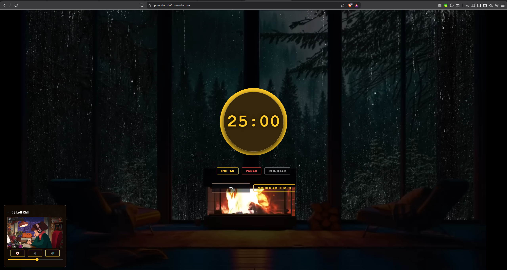

# 🍅 Pomodoro Lofi Focus


> **Una aplicación de productividad que combina la técnica Pomodoro con un ambiente Lofi inmersivo para maximizar la concentración.**

🔗 **Demo en vivo:** [https://pomodoro-lofi.onrender.com/](https://pomodoro-lofi.onrender.com/)

---

## 📸 Vista Previa




---

## 🚀 Características Principales

Esta aplicación no es solo un temporizador; es un **espacio de trabajo** completo diseñado con tecnologías Enterprise Java modernas.

- **⏱️ Gestión de Tiempo Precisa**: Temporizador con estados (Trabajo/Descanso) y controles de Inicio, Pausa y Reinicio.
- **🎧 Ambiente Sonoro Integrado**: Reproductor de música Lofi (YouTube integration) embebido para evitar distracciones externas.
- **⚙️ Configuración Personalizada**: Input dinámico para modificar la duración de las sesiones sobre la marcha.
- **📱 Diseño Reactivo**: Interfaz construida con **Vaadin Flow**, garantizando una experiencia SPA (Single Page Application) fluida sin necesidad de un framework de JS externo.

---

## 🏗️ Arquitectura y Diseño Técnico

Este proyecto destaca por su enfoque en la **calidad del código** y la **escalabilidad**, implementando una arquitectura profesional:

- **Arquitectura Hexagonal (Puertos y Adaptadores)**:
  - `Domain`: Lógica de negocio pura (Entidades `PomodoroState`, Reglas de tiempo).
  - `Application`: Casos de uso y servicios (`PomodoroService`).
  - `Infrastructure`: Adaptadores de entrada (UI con Vaadin) y configuración.
- **Separación de Intereses**: El código desacopla la lógica del temporizador de la vista, permitiendo pruebas unitarias más sencillas y mantenimiento a largo plazo.
- **Gestión de Estado**: Uso de patrones de diseño para manejar el estado de la sesión (corriendo, pausado, finalizado) de forma robusta.

---

## 🛠️ Stack Tecnológico

- **Backend**: Java 21, Spring Boot 3.
- **Frontend**: Vaadin Flow (Java-based UI), CSS3 personalizado.
- **Build Tool**: Maven.
- **Containerización**: Docker (Dockerfile optimizado para producción).
- **Despliegue**: Render Cloud.

---

## 💻 Instalación y Ejecución Local

Puedes ejecutar este proyecto de dos formas:

### Opción A: Usando Maven
```bash
git clone [https://github.com/christianfernandezdev/Pomodoro.git](https://github.com/christianfernandezdev/Pomodoro.git)
cd Pomodoro
./mvnw spring-boot:run
http://localhost:8080
